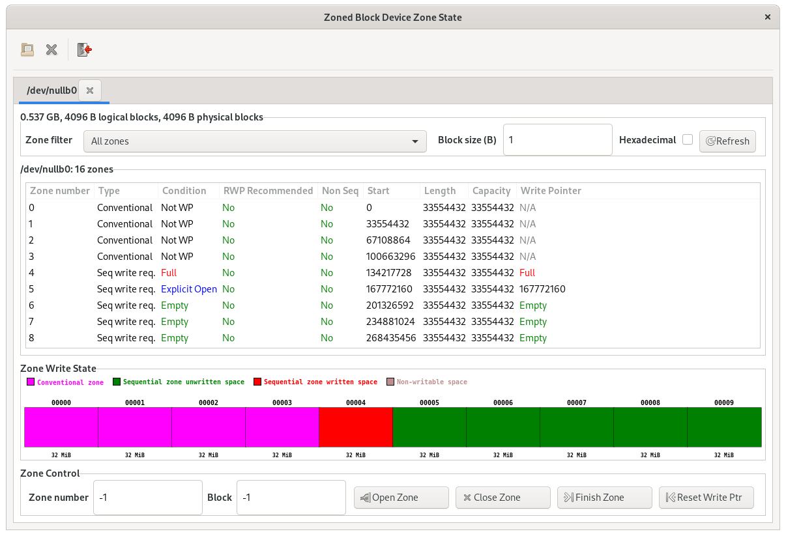

# libzbd User Library

*libzbd* is a user library providing functions for manipulating zoned block
devices.

Unlike the [*libzbc*](libzbc.md) library, *libzbd* does not implement direct
command access to zoned block devices. Rather, *libzbd* uses the kernel provided
zoned block device interface based on the *ioctl()* system call. A direct
consequence of this is that *libzbd* will only allow access to zoned block
devices supported by the kernel running. This includes both physical devices
such as hard-disks supporting the ZBC and ZAC standards, as well as all logical
block devices implemented by various device drivers such as
[*null_blk*](/getting-started/nullblk) and [device mapper](/linux/dm) drivers.

The *libzbd* project is hosted on
<a href="https://github.com/westerndigitalcorporation/libzbd"
target="_blank">GitHub</a>. The project
<a href="https://github.com/westerndigitalcorporation/libzbd/blob/master/README.md"
target="_blank">*README* file</a> provides information on how to compile and 
install *libzbd* library and its tools.

## Overview

*libzbd* provides functions for discovering and managing the state of zones of
zoned block devices. Read and write accesses to the devices can be done using
standard standard I/O system calls.

The execution of *libzbd* functions as well as of write operations to zones of a
device may result in changes to the condition or attributes of the device zones
(such as write pointer location in sequential zones). These changes are not
internally tracked by *libzbd*. In other words, *libzbd* is stateless. It is the
responsibility of applications to implement tracking of the changes to zones
conditions such as the increasing write pointer position of a sequential zone
after the completion of a write request to the zone.

## Library Functions

All *libzbd* functions use bytes unit for zones information such as the zone
start position on the device, a zone size or the zone write pointer location.
Zoned block devices are identified using regular file descriptor numbers that
can be used as is with standard I/O system calls.

However, application programmers must be careful to always implement read
accesses aligned to the device logical block size. Furthermore, on host managed
zoned block devices, write operations to sequential zones must be aligned
to the device physical block size.

The main functions provided by *libzbd* are as follows.

<center>

| Function | Description |
| -------- | ----------- |
| zbd_open() | Open a zoned block device |
| zbd_close() | Close an open zoned block device |
| zbd_get_info() | Get a device information |
| zbd_report_nr_zones() | Get the number of zones of a device|
| zbd_report_zones()<br>zbd_list_zones() | Get a device zone information |
| zbd_zones_operation() | Execute an operation on a range of zones |
| zbd_open_zones() | Explicitly open a range of zone |
| zbd_close_zones() | Close a range of zones |
| zbd_reset_zones() | Reset the write pointer of a range of zones |
| zbd_finish_zones() | Finish a range of zone |

</center>

More detailed information about these functions usage and behavior can be found
in the comments of
<a href="https://github.com/westerndigitalcorporation/libzbd/blob/master/include/libzbd/zbd.h"
target="_blank">*libzbd* header file</a>. This header file is by default
installed as `/usr/include/libzbd/zbd.h`.

*libzbd* does not implement any mutual exclusion mechanism for multi-thread or
multi-process applications. This implies that it is the responsibility of
applications to synchronize the execution of conflicting operations targeting
the same zone. A typical example of such case is concurrent write operations to
the same zone by multiple threads which may result in write errors without
write ordering control by the application.

The following functions are also provided by *libzbd* to facilitate application
development and tests.

<center>

| Function | Description |
| -------- | ----------- |
| zbd_device_is_zoned() | Test if a device is a zoned block device |
| zbd_device_model_str() | Get a string description of a device model |
| zbd_zone_type_str() | Get a string description of a zone type |
| zbd_zone_cond_str() | Get a string description of a zone condition |
| zbd_set_log_level() | Set the library verbosity level |

</center>

All functions will behave in the same manner regardless of the type of disk
being used.

## Utilities

*libzbd* also provides several command line applications to manipulate zoned
block devices by calling the library functions. The list of applications
provided is shown in the table below.

<center>

| Tool | Description |
| -------- | ----------- |
| zbd | Command line utility to report, open, close, reset and finish zones of a device |
| gzbd | Similar to the zbd tool but using a graphical user interface |
| gzbd-viewer | Graphical user interface showing the condition and state of zones of a zoned block device |

</center>

All utilities output a help message when executed without any argument.

```plaintext
# zbd
Usage: zbd <command> [options] <dev>
Command:
  report	: Get zone information
  reset		: Reset zone(s)
  open		: Explicitly open zone(s)
  close		: Close zone(s)
  finish	: Finish zone(s)
Common options:
  -v		   : Verbose mode (for debug)
  -i		   : Display device information
  -ofst <ofst (B)> : Start offset of the first zone of the
		     target range (default: 0)
  -len <len (B)>   : Size of the zone range to operate on
		     (default: device capacity)
  -u <unit (B)>	   : Size unit for the ofst and len options
		     and for displaying zone report results.
		     (default: 1)
Report command options:
  -csv		: Use csv output format
  -n		: Only output the number of zones in the report
  -ro <opt>	: Specify zone report filter.
		  * "em": empty zones
		  * "oi": implicitly open zones
		  * "oe": explicitly open zones
		  * "cl": closed zones
		  * "fu": full zones
		  * "ro": read-only zones
		  * "ol": offline zones
		  * "nw": conventional zones
		  * "ns": non-seq write resource zones
		  * "rw": reset-wp recommended zones
```

Manual pages are also provided for each tool.

```plaintext
# man zbd

ZBD(8)                     System Manager's Manual                       ZBD(8)

NAME
       zbd - manage zoned block devices

SYNOPSIS
       zbd command [options] device

DESCRIPTION
       zbd  is  used  to  manipulate  zones of a zoned block device. Zoned block
       devies are block devices that support the SCSI Zoned Block Commands
       (ZBC), ATA  Zoned-device  ATA  Commands (ZAC)  or  NVMe  Zoned NameSpace
       commands (ZNS).  The zones to operate on can be specified using the
       offset and length options.

       The device argument must be the pathname of the target zoned block
       device.

COMMANDS
   report
       The command zbd report is used to obtain and display the device zone
       information.

       By default, the command will report all zones from the start of the
       device up to the  last zone  of  the  device.  Options may be used to
       modify this behavior, changing the starting zone or the size of the
       report.
...
```

### *zbd* Tool Examples 

The following examples use a null zoned block device with 4 conventional zones
and 12 sequential zones of 32 MB created using the
[*nullblk-zoned.sh*](/getting-started/nullblk/#creating-a-zoned-null-block-device)
script.

```plaintext
# nullblk-zoned.sh 4096 32 4 12
### Created /dev/nullb0
```

The following command can be used to list the zone information for all zones of
a device, including the device information such as logical block size and
capacity.

```plaintext
# zbd report -i /dev/nullb0
Device /dev/nullb0:
    Vendor ID: Unknown
    Zone model: host-managed
    Capacity: 0.537 GB (1048576 512-bytes sectors)
    Logical blocks: 131072 blocks of 4096 B
    Physical blocks: 131072 blocks of 4096 B
    Zones: 16 zones of 32.0 MB
    Maximum number of open zones: no limit
    Maximum number of active zones: no limit
Zone 00000: cnv, ofst 00000000000000, len 00000033554432, cap 00000033554432
Zone 00001: cnv, ofst 00000033554432, len 00000033554432, cap 00000033554432
Zone 00002: cnv, ofst 00000067108864, len 00000033554432, cap 00000033554432
Zone 00003: cnv, ofst 00000100663296, len 00000033554432, cap 00000033554432
Zone 00004: swr, ofst 00000134217728, len 00000033554432, cap 00000033554432, wp 00000134217728, em, non_seq 0, reset 0
Zone 00005: swr, ofst 00000167772160, len 00000033554432, cap 00000033554432, wp 00000167772160, em, non_seq 0, reset 0
Zone 00006: swr, ofst 00000201326592, len 00000033554432, cap 00000033554432, wp 00000201326592, em, non_seq 0, reset 0
Zone 00007: swr, ofst 00000234881024, len 00000033554432, cap 00000033554432, wp 00000234881024, em, non_seq 0, reset 0
Zone 00008: swr, ofst 00000268435456, len 00000033554432, cap 00000033554432, wp 00000268435456, em, non_seq 0, reset 0
Zone 00009: swr, ofst 00000301989888, len 00000033554432, cap 00000033554432, wp 00000301989888, em, non_seq 0, reset 0
Zone 00010: swr, ofst 00000335544320, len 00000033554432, cap 00000033554432, wp 00000335544320, em, non_seq 0, reset 0
Zone 00011: swr, ofst 00000369098752, len 00000033554432, cap 00000033554432, wp 00000369098752, em, non_seq 0, reset 0
Zone 00012: swr, ofst 00000402653184, len 00000033554432, cap 00000033554432, wp 00000402653184, em, non_seq 0, reset 0
Zone 00013: swr, ofst 00000436207616, len 00000033554432, cap 00000033554432, wp 00000436207616, em, non_seq 0, reset 0
Zone 00014: swr, ofst 00000469762048, len 00000033554432, cap 00000033554432, wp 00000469762048, em, non_seq 0, reset 0
Zone 00015: swr, ofst 00000503316480, len 00000033554432, cap 00000033554432, wp 00000503316480, em, non_seq 0, reset 0
```

The same zone information can also be obtained in csv format to facilitate
parsing using scripting languages, including shell scripts.

```plaintext
# zbd report -csv /dev/nullb0
zone num, type, ofst, len, cap, wp, cond, non_seq, reset
00000, 1, 00000000000000, 00000033554432, 00000033554432, 00000033554432, 0x0, 0, 0
00001, 1, 00000033554432, 00000033554432, 00000033554432, 00000067108864, 0x0, 0, 0
00002, 1, 00000067108864, 00000033554432, 00000033554432, 00000100663296, 0x0, 0, 0
00003, 1, 00000100663296, 00000033554432, 00000033554432, 00000134217728, 0x0, 0, 0
00004, 2, 00000134217728, 00000033554432, 00000033554432, 00000134217728, 0x1, 0, 0
00005, 2, 00000167772160, 00000033554432, 00000033554432, 00000167772160, 0x1, 0, 0
00006, 2, 00000201326592, 00000033554432, 00000033554432, 00000201326592, 0x1, 0, 0
00007, 2, 00000234881024, 00000033554432, 00000033554432, 00000234881024, 0x1, 0, 0
00008, 2, 00000268435456, 00000033554432, 00000033554432, 00000268435456, 0x1, 0, 0
00009, 2, 00000301989888, 00000033554432, 00000033554432, 00000301989888, 0x1, 0, 0
00010, 2, 00000335544320, 00000033554432, 00000033554432, 00000335544320, 0x1, 0, 0
00011, 2, 00000369098752, 00000033554432, 00000033554432, 00000369098752, 0x1, 0, 0
00012, 2, 00000402653184, 00000033554432, 00000033554432, 00000402653184, 0x1, 0, 0
00013, 2, 00000436207616, 00000033554432, 00000033554432, 00000436207616, 0x1, 0, 0
00014, 2, 00000469762048, 00000033554432, 00000033554432, 00000469762048, 0x1, 0, 0
00015, 2, 00000503316480, 00000033554432, 00000033554432, 00000503316480, 0x1, 0, 0
```

### Zone Operations

The *zbd* tool also allow executing zone management operations over a range of
zones. The following example explicitely opens the first 2 sequential zones of
the *null_blk* device.

```plaintext
# zbd open -ofst 134217728 -len 67108864 /dev/nullb0 
# zbd report /dev/nullb0
Zone 00000: cnv, ofst 00000000000000, len 00000033554432, cap 00000033554432
Zone 00001: cnv, ofst 00000033554432, len 00000033554432, cap 00000033554432
Zone 00002: cnv, ofst 00000067108864, len 00000033554432, cap 00000033554432
Zone 00003: cnv, ofst 00000100663296, len 00000033554432, cap 00000033554432
Zone 00004: swr, ofst 00000134217728, len 00000033554432, cap 00000033554432, wp 00000134217728, {==oe==}, non_seq 0, reset 0
Zone 00005: swr, ofst 00000167772160, len 00000033554432, cap 00000033554432, wp 00000167772160, {==oe==}, non_seq 0, reset 0
Zone 00006: swr, ofst 00000201326592, len 00000033554432, cap 00000033554432, wp 00000201326592, em, non_seq 0, reset 0
Zone 00007: swr, ofst 00000234881024, len 00000033554432, cap 00000033554432, wp 00000234881024, em, non_seq 0, reset 0
Zone 00008: swr, ofst 00000268435456, len 00000033554432, cap 00000033554432, wp 00000268435456, em, non_seq 0, reset 0
Zone 00009: swr, ofst 00000301989888, len 00000033554432, cap 00000033554432, wp 00000301989888, em, non_seq 0, reset 0
Zone 00010: swr, ofst 00000335544320, len 00000033554432, cap 00000033554432, wp 00000335544320, em, non_seq 0, reset 0
Zone 00011: swr, ofst 00000369098752, len 00000033554432, cap 00000033554432, wp 00000369098752, em, non_seq 0, reset 0
Zone 00012: swr, ofst 00000402653184, len 00000033554432, cap 00000033554432, wp 00000402653184, em, non_seq 0, reset 0
Zone 00013: swr, ofst 00000436207616, len 00000033554432, cap 00000033554432, wp 00000436207616, em, non_seq 0, reset 0
Zone 00014: swr, ofst 00000469762048, len 00000033554432, cap 00000033554432, wp 00000469762048, em, non_seq 0, reset 0
Zone 00015: swr, ofst 00000503316480, len 00000033554432, cap 00000033554432, wp 00000503316480, em, non_seq 0, reset 0
```

Writing 32MB to the first zone using dd will transition the zone to full state.

```plaintext
# dd if=/dev/zero of=/dev/nullb0 oflag=direct bs=1M count=32 seek=128
32+0 records in
32+0 records out
33554432 bytes (34 MB, 32 MiB) copied, 0.00945045 s, 3.6 GB/s
# zbd report /dev/nullb0
Zone 00000: cnv, ofst 00000000000000, len 00000033554432, cap 00000033554432
Zone 00001: cnv, ofst 00000033554432, len 00000033554432, cap 00000033554432
Zone 00002: cnv, ofst 00000067108864, len 00000033554432, cap 00000033554432
Zone 00003: cnv, ofst 00000100663296, len 00000033554432, cap 00000033554432
Zone 00004: swr, ofst 00000134217728, len 00000033554432, cap 00000033554432, wp 00000167772160, {==fu==}, non_seq 0, reset 0
Zone 00005: swr, ofst 00000167772160, len 00000033554432, cap 00000033554432, wp 00000167772160, oe, non_seq 0, reset 0
Zone 00006: swr, ofst 00000201326592, len 00000033554432, cap 00000033554432, wp 00000201326592, em, non_seq 0, reset 0
Zone 00007: swr, ofst 00000234881024, len 00000033554432, cap 00000033554432, wp 00000234881024, em, non_seq 0, reset 0
Zone 00008: swr, ofst 00000268435456, len 00000033554432, cap 00000033554432, wp 00000268435456, em, non_seq 0, reset 0
Zone 00009: swr, ofst 00000301989888, len 00000033554432, cap 00000033554432, wp 00000301989888, em, non_seq 0, reset 0
Zone 00010: swr, ofst 00000335544320, len 00000033554432, cap 00000033554432, wp 00000335544320, em, non_seq 0, reset 0
Zone 00011: swr, ofst 00000369098752, len 00000033554432, cap 00000033554432, wp 00000369098752, em, non_seq 0, reset 0
Zone 00012: swr, ofst 00000402653184, len 00000033554432, cap 00000033554432, wp 00000402653184, em, non_seq 0, reset 0
Zone 00013: swr, ofst 00000436207616, len 00000033554432, cap 00000033554432, wp 00000436207616, em, non_seq 0, reset 0
Zone 00014: swr, ofst 00000469762048, len 00000033554432, cap 00000033554432, wp 00000469762048, em, non_seq 0, reset 0
Zone 00015: swr, ofst 00000503316480, len 00000033554432, cap 00000033554432, wp 00000503316480, em, non_seq 0, reset 0
```

Other possible zone operations are *close*, *reset* and *finish*.

### Graphical Interface

*gzbd* provides a graphical user interface showing the zone configuration and
state of a zoned block device. *gzbd* also  displays  the  write status (write
pointer position) of zones graphically using color coding (red for written
sectors and green for unwritten sectors). Operations on zones can also be
executed directly from the interface (reset zone write pointer, open zone,
close zone, etc).

<center>

<br>*gzbd screenshot*</br>
</center>

The *gzbd-viewer* graphical interface is a simpler tool than *gzbd* that only
allows displaying the current zone condition and state of a zoned block device.
The zone state is refreshed by defaul twice per second. This period can be
adjusted using a command line option.

<center>

<br>*gzbd-viewer screenshot*</br>
</center>

Using *gzbd* enables simple visual cues as to how an application is performaing
and using the zones of a zoned block device. The following example illustrates
this.

<video style="width:100%" controls>
  <source src="/assets/img/projects-libzbd-gzbd-viewer-example.mp4" type="video/mp4">
*Application execution observed with gzbd-viewer*
</video>

